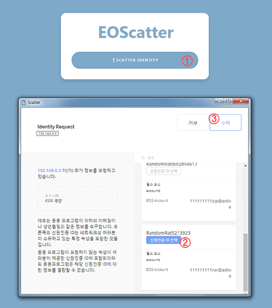
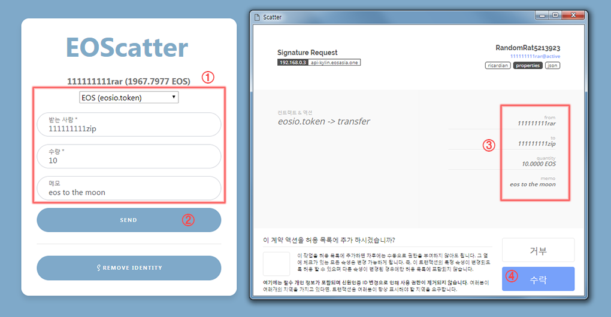
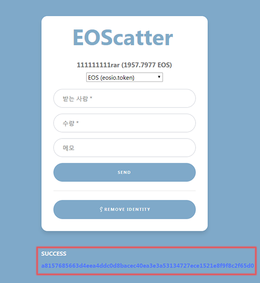
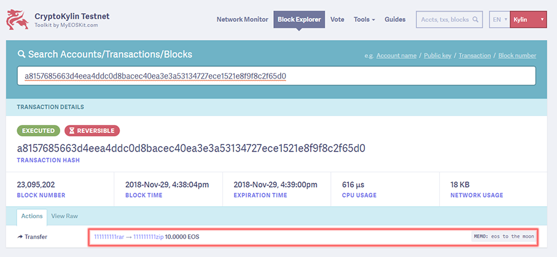

# EOScatter Wallet 구현하기
EOSJS와 ScatterJS를 이용하여 간단한 EOS 웹 지갑 서비스를 구현해 봅니다.

&nbsp;
## Part 1: 개발 환경 설정
### 1.1. Install the prerequisites

- 테스트넷 (https://cryptokylin.io)

  - Github      :  https://github.com/cryptokylin/CryptoKylin-Testnet
  - 계정 생성 :  http://faucet.cryptokylin.io/create_account?new_account_name
  - 코인 받기 :  http://faucet.cryptokylin.io/get_token?your_account_name
  
  CryptoKylin 테스트넷 정보
  ```
  blockchain:'eos',
  chainId:'5fff1dae8dc8e2fc4d5b23b2c7665c97f9e9d8edf2b6485a86ba311c25639191',
  host:'api-kylin.eosasia.one',
  port:443,
  protocol:'https'
  ```

- Scatter Classic (Extension) :  크롬 확장 프로그램 설치 및 설정

- NPM : https://nodejs.org


### 1.2. git clone
```
$ git clone https://github.com/moon382/EOScatterWallet
```


### 1.3. npm install
```
$ cd ./EOScatterWallet
$ npm install
```


### 1.4. 실행
```
$ npm run serve
```

✔︎ 다음과 같은 결과가 출력됩니다.
```
> http-server ./
Starting up http-server, serving ./
Available on:
    http://127.0.0.1:8080
    http://192.168.0.27:8080
Hit CTRL-C to stop the server
```


### 1.5. 크롬 웹 브라저 주소창에 URL 입력
```
URL : http://127.0.0.1:8080 
```


### 1.6. EOS 웹 지갑 서비스 확인


- 해당 URL로 접속 후 첫 화면이 나타나면 "SCATTER IDENTITY" 버튼을 클릭 합니다.
- Scatter의 "Identity Request" 창이 나타나면 원하는 계정을 선택 합니다.
- "수락" 버튼을 클릭 하여 로그인 합니다.

&nbsp;



- 전송을 원하는 EOS 또는 토큰을 선택하고 받는 사람, 수량, 메모(필수사항 아님)를 입력 합니다.
- "SEND" 버튼을 클릭합니다.
- Scatter의 "Signature Request" 창이 나타나면, 입력 정보를 다시 한번 확인 합니다.
- "수락" 버튼을 클릭하여, 코인을 전송합니다.

&nbsp;



- 전송에 성공하면, 위와 같이 SUCCESS 메세지와 함께 트랜잭션 ID를 확인할 수 있습니다. 

&nbsp;



- 트랜잭션 ID를 클릭하면 위와 같이 테스트넷 익스플로러에서 전송된 트랜잭션 정보를 확인 할 수 있습니다.
